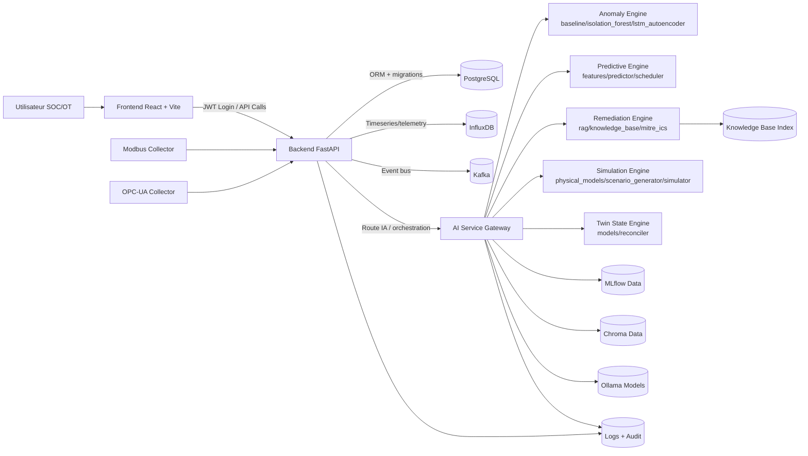

# ControlTwin ICS Platform

<p align="center">
  <strong>Plateforme professionnelle de supervision, cybersécurité et jumeau numérique pour environnements ICS/OT.</strong><br/>
  Frontend React • Backend FastAPI • Services IA (Anomaly, Predictive, Remediation, Simulation, Twin State)
</p>

<p align="center">
  
  
  
  
  
</p>

---

## Sommaire

- [1. Objectif du projet](#1-objectif-du-projet)
- [2. Capacités principales](#2-capacités-principales)
- [3. Architecture globale](#3-architecture-globale)
- [4. Diagramme détaillé (Mermaid)](#4-diagramme-détaillé-mermaid)
- [5. Structure du dépôt](#5-structure-du-dépôt)
- [6. Stack technique](#6-stack-technique)
- [7. Démarrage rapide](#7-démarrage-rapide)
- [8. Démarrage manuel par service](#8-démarrage-manuel-par-service)
- [9. Authentification, comptes de dev et sécurité](#9-authentification-comptes-de-dev-et-sécurité)
- [10. API et endpoints clés](#10-api-et-endpoints-clés)
- [11. Paramètres (Settings)](#11-paramètres-settings)
- [12. Tests, validation et qualité](#12-tests-validation-et-qualité)
- [13. Observabilité & exploitation](#13-observabilité--exploitation)
- [14. Dépannage (Runbook)](#14-dépannage-runbook)
- [15. Contribution & gouvernance technique](#15-contribution--gouvernance-technique)
- [16. Roadmap technique recommandée](#16-roadmap-technique-recommandée)

---

## 1. Objectif du projet

**ControlTwin** est une plateforme orientée **ICS/OT** conçue pour :

- superviser les actifs industriels et leurs collecteurs de données,
- corréler les événements opérationnels et cybersécurité,
- piloter un **jumeau numérique** exploitable en temps réel,
- intégrer des services IA pour la détection d’anomalies, la prédiction et la remédiation.

Le projet adopte une approche **multi-services** afin de garantir :

- **évolutivité** (scaling horizontal des composants),
- **maintenabilité** (séparation claire des responsabilités),
- **résilience** (isolation des domaines techniques).

---

## 2. Capacités principales

### Supervision OT/ICS
- Gestion des **sites**, **assets**, **collecteurs** et **utilisateurs**.
- Tableau de bord centralisé et vues métier.

### Cybersécurité opérationnelle
- Gestion d’**alertes** et flux de traitement associés.
- Contrôle d’accès basé sur rôles (**RBAC**).

### Jumeau numérique & IA
- Détection d’anomalies (baseline, Isolation Forest, LSTM Autoencoder).
- Fonctions de simulation et de scénarisation.
- Aide à la remédiation (moteur + base de connaissances type RAG).
- Moteur d’état du jumeau et réconciliation.

---

## 3. Architecture globale

```text
ControlTwin/
├─ controltwin-frontend/    # Application web React/Vite (UI Ops & Security)
├─ controltwin-backend/     # API FastAPI métier + Auth + RBAC + PostgreSQL
├─ controltwin-ai/          # Services IA spécialisés (anomaly/predictive/remediation/simulation/twin_state)
├─ docker-compose.yml       # Orchestration globale (racine)
├─ start.bat / start.sh     # Démarrage simplifié
└─ validate_controltwin.py  # Validation/contrôle d’intégrité
```

---

## 4. Diagramme détaillé (Mermaid)

> Ce diagramme illustre les flux principaux entre l’interface, l’API backend, la persistance et les services IA.



### Lecture architecture
- **Frontend** : consomme uniquement les APIs sécurisées.
- **Backend** : cœur métier, authentification, RBAC, persistance, orchestration.
- **AI Service** : moteurs spécialisés exposés via API dédiée.
- **Collecteurs OT** : alimentent la plateforme en télémétrie.
- **Stores IA** : MLflow/Chroma/Ollama pour expérimentations, index et modèles.

---

## 5. Structure du dépôt

```text
controltwin-frontend/
  src/
    api/
    components/
    hooks/
    pages/
    router/
    store/
    lang/

controltwin-backend/
  app/
    api/v1/
    auth/
    collectors/
    core/
    db/
    models/
    schemas/
    services/
  alembic/
    versions/
  scripts/

controltwin-ai/
  app/
    api/
    anomaly/
    predictive/
    remediation/
    simulation/
    twin_state/
    workers/
  tests/
```

---

## 6. Stack technique

### Frontend
- **React** + **Vite**
- Architecture composants/pages/hooks
- Intégration API via modules dédiés (`src/api/*`)
- Internationalisation (EN/FR)

### Backend
- **FastAPI**
- **SQLAlchemy** + **Alembic**
- **PostgreSQL**
- Authentification JWT + RBAC
- Services métiers structurés par domaine

### IA
- Services Python modulaires
- Détection d’anomalies multi-approches
- Remédiation guidée (RAG + connaissances ICS/MITRE)
- Composants de simulation et jumeau numérique

### DevOps / Exécution
- Docker / Docker Compose
- Scripts de démarrage (`start.bat`, `start.sh`)
- Tests automatisés (backend, ai, frontend)

---

## 7. Démarrage rapide

### Prérequis
- Docker + Docker Compose
- Node.js LTS + npm
- Python 3.11+
- Git

### Option recommandée (global)

#### Windows
```bash
start.bat
```

#### Linux/macOS
```bash
chmod +x start.sh
./start.sh
```

---

## 8. Démarrage manuel par service

### 8.1 Backend
```bash
cd controltwin-backend
docker compose up -d
```

### 8.2 Frontend
```bash
cd controltwin-frontend
npm install
npm run dev
```

### 8.3 AI Service (si exécuté séparément)
```bash
cd controltwin-ai
# selon votre mode d’exécution (docker-compose.ai.yml / runtime local)
```

---

## 9. Authentification, comptes de dev et sécurité

### Compte de développement (local uniquement)
- **Username**: `admin`
- **Password**: `ControlTwin2025!`

### Principes sécurité essentiels
- Interdire les credentials par défaut en production.
- Stocker secrets via variables d’environnement / secret manager.
- Limiter CORS et appliquer principe du moindre privilège.
- Activer journalisation d’audit et supervision sécurité.
- Segmenter réseau OT/IT selon les politiques de l’organisation.

---

## 10. API et endpoints clés

Base API locale : `http://localhost:8000/api/v1`

| Domaine | Endpoint | Méthode | Description |
|---|---|---|---|
| Auth | `/auth/login` | POST | Authentification utilisateur |
| Auth | `/auth/refresh` | POST | Renouvellement token |
| Users | `/users/me` | GET | Profil utilisateur courant |
| Sites | `/sites` | GET | Liste des sites |
| Assets | `/assets` | GET | Inventaire des actifs |
| Alerts | `/alerts` | GET | Liste des alertes |
| Settings | `/settings` | GET | Lecture paramètres |
| Settings | `/settings/{key}` | PUT | Mise à jour ciblée |
| Settings | `/settings/bulk` | POST | Mise à jour batch |

---

## 11. Paramètres (Settings)

Le module **Settings** fournit une persistance des préférences applicatives.

### Capacités
- Paramètres d’affichage/UI
- Notifications
- Dashboard
- Sécurité
- Data collection
- Sauvegarde bulk

### Points techniques
- Scope utilisateur (`scope=user`) disponible.
- Persistance côté backend dans la table dédiée.
- Endpoint principal : `POST /api/v1/settings/bulk`.

---

## 12. Tests, validation et qualité

### Exemple de test API (login)
```bash
curl -X POST http://localhost:8000/api/v1/auth/login \
  -H "Content-Type: application/json" \
  -d "{\"username\":\"admin\",\"password\":\"ControlTwin2025!\"}"
```

### Recommandations qualité
- Couvrir scénarios nominaux + erreurs.
- Valider RBAC par rôle.
- Tester persistance après redémarrage.
- Vérifier régression frontend/backend/ai avant release.

### Suites présentes dans le dépôt
- `controltwin-backend/tests/`
- `controltwin-ai/tests/`
- `controltwin-frontend/src/App.test.jsx`

---

## 13. Observabilité & exploitation

### Logs
- Activer logs structurés (niveau, trace_id, user_id, site_id si disponible).
- Centraliser les logs backend + ai.

### Indicateurs recommandés
- Latence API p95/p99
- Taux d’erreur 4xx/5xx
- Débit d’ingestion collecteurs
- Nombre d’alertes par criticité
- Durée moyenne de traitement de remédiation

### Exploitation
- Vérifier l’état des conteneurs.
- Contrôler la santé DB/migrations.
- Mettre en place alerting proactif (SLO/SLA internes).

---

## 14. Dépannage (Runbook)

### Frontend inaccessible
- Vérifier le port Vite affiché (`5173`, `5174`, ...).
- Contrôler les erreurs console navigateur.

### Erreur de connexion utilisateur
- Vérifier seeds, état DB, et endpoint `/auth/login`.
- Contrôler l’horloge système (impact JWT potentiel).

### Échec settings bulk
- Vérifier token JWT.
- Vérifier backend sur `/api/v1/settings/bulk`.
- Analyser logs backend (4xx/5xx).

### Problèmes de migrations
- Contrôler la version Alembic actuelle.
- Réaligner migration head avant redéploiement.

### Dysfonctionnement IA
- Vérifier disponibilité des artefacts (`mlflow_data`, `chroma_data`, `ollama_models`).
- Vérifier logs des workers et routes API IA.

---

## 15. Contribution & gouvernance technique

### Convention de contribution
1. Décrire clairement le besoin fonctionnel.
2. Documenter impacts API/UI/DB.
3. Ajouter/adapter tests.
4. Mettre à jour la documentation.

### Qualité des PR
- PRs atomiques et lisibles.
- Nommage explicite.
- Validation locale avant soumission.

---

## 16. Roadmap technique recommandée

- Renforcer observabilité (metrics + tracing distribué).
- Standardiser les contrats inter-services (OpenAPI/AsyncAPI).
- Durcir posture sécurité OT (politiques réseau + secrets management).
- Introduire tests de charge et chaos engineering ciblé.
- Industrialiser CI/CD multi-services avec gates qualité.

---

## Mainteneurs

Projet maintenu par l’équipe **ControlTwin**.  
Ce README est structuré pour servir de **référence technique d’architecture, d’exploitation et de gouvernance** du projet.
